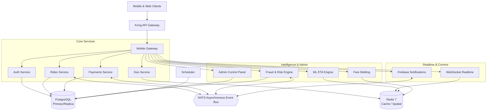

# 🚗 Distributed Ride-Hailing Platform (Uber-Scale Architecture)

[](https://golang.org)
[](https://www.docker.com)
[](https://kubernetes.io)
[](#observability-stack)
[](#security-first-design)

A production-grade, highly resilient distributed ride-hailing platform built in **Go 1.24**. This project showcases Staff-level system design principles, featuring **14 specialized microservices** communicating via an asynchronous event bus (NATS), advanced spatial indexing (Uber's H3 grid), real-time WebSockets, and a hardened zero-trust security model.

Designed to emulate the core engineering achievements of platforms like Uber and Lyft, this codebase serves as a direct demonstration of building, testing, securing, and scaling enterprise-level cloud-native systems.

---

## 🚀 Engineering Capabilities Demonstrated (HR & Hiring Manager Quick-Scan)

If you are evaluating this codebase for a senior/staff engineering role, here are the exact capabilities demonstrated:

*   **Distributed Systems Architecture**: 14 decoupled microservices utilizing an asynchronous, event-driven pattern over NATS for low latency and high availability.
*   **High-Concurrency & Real-Time Streaming**: Real-time driver tracking and bidding using Redis Geospatial indexes, pub/sub, and WebSockets.
*   **Enterprise Security (Zero-Trust)**: Zero-downtime asymmetric JWT key rotation, strict Role-Based Access Control (RBAC), automatic request sanitization, and structured audit logs.
*   **Advanced Spatial Resolution**: Use of Uber's H3 Hexagonal Hierarchical Spatial Indexing for dynamic surge pricing, supply/demand zone calculations, and O(1) geospatial lookup.
*   **Microservice Resilience Patterns**: Distributed rate limiters, custom circuit breakers, graceful shutdown handlers, and jittered exponential backoffs.
*   **100% Production Readiness**: Multi-stage Docker builds, Kubernetes manifests, comprehensive Swagger/OpenAPI documentation, a robust CI/CD pipeline, and structured logging.

---

## 🗺️ System Architecture



---

## 🛠️ The Microservices Ecosystem

Each of the 14 microservices is built around the **Handler ➡️ Service ➡️ Repository** pattern, enforcing strict separation of concerns:

| Service | Port | Primary Tech | Business Responsibility |
|:---|:---:|:---|:---|
| **Auth** | `8081` | JWT, Bcrypt | Zero-downtime key rotation, secure authentication, RBAC. |
| **Rides** | `8082` | Go, pgx | Core ride lifecycle management, trip routing, surge pricing. |
| **Geo** | `8083` | Redis Spatial, H3 | Dynamic driver location index, hexagonal demand forecasting. |
| **Payments**| `8084` | Stripe API, Wallets | Financial transaction processing, driver split ledger. |
| **Realtime**| `8086` | WebSockets | Low-latency state sync, WebSocket connections, live driver map. |
| **Negotiation**| `8094` | WebSockets | Driver-Rider fare negotiation/bidding system. |
| **Fraud** | `8092` | ML Model, Go | Real-time transaction risk scoring and anomaly detection. |
| **ML ETA** | `8093` | Python/Go, Redis | Machine learning-based trip duration and arrival estimation. |
| **Mobile** | `8087` | API Gateway | Mobile-optimized entry point, payload aggregation. |
| **Notifs** | `8085` | Twilio, Firebase | Multichannel notifications (Push, SMS, Email). |
| **Scheduler**| `8090` | Cron, Redis | Background job execution and scheduled trip dispatches. |
| **Analytics**| `8091` | Time-Series DB | Business intelligence metrics, system load telemetry. |
| **Admin** | `8088` | Go | Internal management dashboard for system administrators. |
| **Promos** | `8089` | Redis, Postgres | Promotional code validation and referral rewards. |

---

## 🔒 Security-First Design

This platform was built to meet strict financial and data-privacy standards:
*   **Asymmetric JWT Key Rotation**: Keys are automatically rotated in the background with zero-downtime, utilizing a grace period configuration that keeps active sessions valid.
*   **Audit Trail Middleware**: Automatically intercepts and logs all state-changing operations (POST, PUT, DELETE), hashing request payloads (SHA-256) to comply with data privacy standards (GDPR/CCPA).
*   **Request Sanitization**: Intercepts payloads to strip XSS vectors, prevent SQL injections via `pgx` parameterized inputs, and enforce HTTP security headers.

## ⚡ Performance Optimization

*   **Cache-Aside Decorators**: Transparent Redis caching layers (`internal/auth/cached_service.go`) reduce database read bottlenecks on user profiles.
*   **Concurrent DB Indexes**: Optimized hot-paths via 6 specialized database indexes (e.g., matching stats, active trip filtering) using concurrent index creation to prevent table locks.
*   **Connection Pool Telemetry**: Exposes detailed internal statistics of PostgreSQL (`pgxpool`) and Redis connection pools to Prometheus to detect leakages or exhaustion.

---

## 🚀 Quick Start (Run the Entire Stack)

### Prerequisites
*   Go 1.24+
*   Docker & Docker Compose
*   GNU Make

### 1-Command Bootstrap
Launch the local developer infrastructure (PostgreSQL, Redis, NATS), run the 24 migrations, and verify the entire test suite passes:

```bash
# Bootstrap infra, run migrations, and execute tests
make setup
```

### Run an Individual Service
```bash
# Runs the authentication service on port 8081
make run-auth
```

### Static Analysis & Verification
Run the production linter suite (configured with 15+ linters in `.golangci.yml`) and security scanners:

```bash
# Run security scanners (gosec + govulncheck)
make security-scan

# Run all code quality checks, linters, tests, and scans
make check-all
```

---

## 📂 Project Architecture Layout

The repository utilizes a modular, clean Go structure conforming to industry-standard layout conventions:

```text
ride-hailing/
├── cmd/                    # 14 microservice entry points (main.go)
├── internal/               # Domain-specific business logic (Handler-Service-Repo)
│   ├── auth/               # Hardened authentication & validation
│   ├── rides/              # Ride lifecycle & driver matching engine
│   └── geo/                # Geospatial location trackers
├── pkg/                    # Shared infrastructure packages (no business logic)
│   ├── database/           # Postgres pool management & health metrics
│   ├── middleware/         # CORS, Rate-Limiting, Audit, Security middleware
│   └── resilience/         # Circuit Breaker & Exponential Backoff engines
├── db/migrations/          # 24 schema migrations (users, rides, wallets, etc.)
├── docs/                   # Architectural blueprints & OpenAPI specs
└── Makefile                # Clean, human-readable execution helper commands
```

---

## 📈 System Resilience & Observability

*   **Fail-Safe Operations**: Outages in payment gateways or notification providers degrade gracefully. A custom circuit breaker (`pkg/resilience`) wraps external APIs to prevent blocking call queues.
*   **Distributed Tracing**: Structured log fields carry trace IDs across HTTP and NATS boundaries using OpenTelemetry context propagation, routing diagnostic insights straight to Sentry.
*   **Metrics & Dashboards**: Prometheus collectors track route execution times, error rates, database connection state, and system resource metrics.

---

## 📄 License
This project is open-source and available under the [MIT License](LICENSE).
