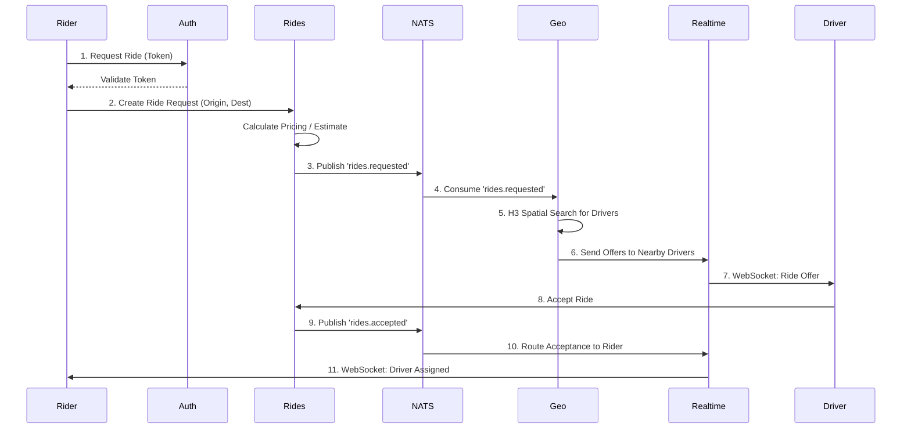

# System Architecture

This document details the architecture, data flows, and technical decisions underpinning the ride-hailing microservices platform.

## System Overview

The platform consists of 14 loosely coupled Go 1.24 microservices orchestrated via Kubernetes and exposed through a Kong API Gateway. State is managed across PostgreSQL and Redis, while NATS facilitates a robust event-driven backbone.

```mermaid
flowchart TB
    Clients[Mobile / Web Clients] --> Kong[Kong API Gateway]

    subgrade Core Business Services
        Kong --> Auth
        Kong --> Rides
        Kong --> Payments
        Kong --> Negotiation
    end

    subgrade Geospatial & Matching
        Kong --> Geo
        Kong --> ML[ML ETA]
        Kong --> Fraud
    end

    subgrade Realtime & Comms
        Kong --> Realtime
        Kong --> Notifs[Notifications]
        Kong --> Mobile[Mobile Gateway]
    end

    subgrade Platform & Internal
        Kong --> Admin
        Kong --> Promos
        Kong --> Scheduler
        Kong --> Analytics
    end

    %% Data Stores
    Postgres[(PostgreSQL\n24 Migrations)]
    Redis[(Redis 7\nGeo/Cache)]
    NATS{{NATS\nEvent Bus}}

    %% Connections
    Auth & Rides & Payments & Admin & Promos & Analytics & Fraud & Scheduler -.-> Postgres
    Geo & Realtime & ML & Negotiation & Rides -.-> Redis
    
    Rides & Payments & Fraud & Analytics & Notifs & Scheduler <==> NATS
```

## Service Communication Patterns

1. **Synchronous (HTTP/REST)**: Used for direct client-to-service requests via Kong (e.g., logging in, initiating a ride request, fetching a user profile) and latency-sensitive internal API calls.
2. **Asynchronous (NATS Event Bus)**: Utilized for fire-and-forget workflows and decoupled state changes. Standard events include `rides.requested`, `rides.accepted`, `rides.completed`, and `rides.cancelled`.
3. **Real-time (WebSocket)**: Managed by the `Realtime` service for bi-directional communication. Used for live driver location updates, in-app chat, and driver bidding matching flows.

## Data Flow for Key Operations

### Ride Request Lifecycle



### Payment Flow
1. **Rides**: Emits `rides.completed` via NATS.
2. **Payments**: Consumes event, calculates final fare.
3. **Payments**: Deducts from internal Wallet or charges Stripe via external API.
4. **Payments**: Allocates split to driver's Earnings pool.
5. **Analytics/Fraud**: Subscribes to transaction events for auditing.

## Database Architecture

### PostgreSQL (via `pgxpool`)
The primary source of truth, utilizing connection pooling (`pgxpool`) for high concurrency. Data is heavily normalized across schemas. 
- **24 Migrations covering**: users, drivers, rides, payments, wallets, notifications, promos, disputes, documents, demand forecasting, earnings, experiments, negotiations, fraud, geography, pricing.

### Redis 7
- **Driver Locations**: Leverages Redis GeoSpatial functions and H3 indexes for sub-millisecond driver matching.
- **Session & Caching**: JWT denylists, session data, user profiles.
- **Ride Offer Tracking**: TTL-based keys for transient ride offers during dispatch.
- **Rate Limiting & Features**: High-throughput access for rate limit counters and feature flag rules.

## Key Technical Decisions

*For detailed historical context, see the ADRs in `docs/adr/`.*

- **H3 Geospatial Indexing over PostGIS**: To compute dynamic surge zones and rapid driver matching, we utilize Uber's H3 grid system. It provides consistent O(1) hexagonal bucket lookups compared to heavy point-in-polygon calculations.
- **NATS over Kafka**: NATS provides lower operational complexity, lower latency for real-time pub/sub, and seamless deployment within K8s, fitting perfectly for our ephemeral ride events.
- **`pgx` over `database/sql`**: Direct use of `pgx` unlocks PostgreSQL-native features (Listen/Notify, fast binary protocol, complex array types) with significant performance gains.
- **Gin over stdlib**: Adopted for its high-performance radix tree router and mature middleware ecosystem, drastically reducing boilerplate for our 14 services.

## Resilience Patterns

- **Circuit Breakers (`pkg/resilience`)**: Used wrapping external dependencies (Stripe, Firebase) to fail fast during outages and prevent thread pool exhaustion.
- **Rate Limiting (`pkg/ratelimit`)**: Distributed token bucket implementation using Redis to defend against DDoS and brute force attacks.
- **Retry Mechanisms**: Configurable exponential backoff with jitter applied to transient NATS publish failures and HTTP 5xx responses.
- **Graceful Shutdown**: Services trap `SIGTERM`, stop accepting new HTTP/NATS traffic, and drain existing requests/connections over a 30s window.
- **Health Checks**: Standardized `/health/liveness`, `/health/readiness`, and `/health/startup` probes configured for K8s orchestration.

## Observability Stack

- **Metrics**: Application and Go runtime metrics exposed per-service and scraped by **Prometheus**. Visualized via structured **Grafana** dashboards.
- **Distributed Tracing**: Standardized **OpenTelemetry** instrumentation propagates `traceparent` headers across HTTP and NATS boundaries. Stored and queried via Grafana Tempo.
- **Logging**: High-performance structured JSON logging via **Uber's Zap**.
- **Error Tracking**: **Sentry** hooks capture panics and unhandled errors, bubbling up context (trace ID, user ID).

## Security Architecture

- **Authentication**: JWT-based auth with automated, zero-downtime asymmetric key rotation.
- **Authorization**: Granular RBAC ensuring isolation between admin, driver, and rider roles.
- **Request Sanitization**: Custom middleware strips executable code and limits payload sizes to prevent injection and buffer overflows.
- **Data Protection**: Strict adherence to security headers (HSTS, CSP), robust `bcrypt` password hashing, and encrypted at-rest configurations for PII.
- **DDoS Mitigation**: IP-based and user-based rate limiting per endpoint layer.

## Scaling Strategy

Services are independently scalable horizontally. Services are stateless (state pushed to Redis/PG). Auto-scaling (HPA) is driven by custom metrics:
- **Rides & Geo**: Scale on CPU and NATS queue lag.
- **Realtime**: Scales based on concurrent WebSocket connections.
- **Workers/Scheduler**: Scale on background job queue depths.
